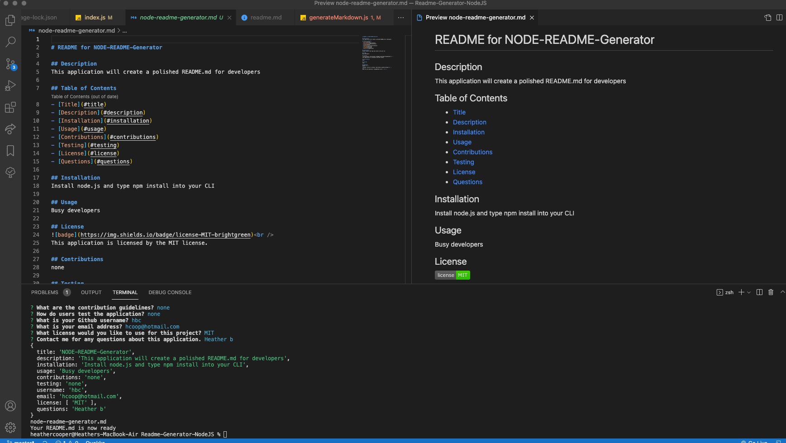

# README-Generator-NodeJS

---
### __Table of Contents__

- [README-Generator-NodeJS](#readme-generator-nodejs)
    - [__Table of Contents__](#table-of-contents)
    - [__Description__](#description)
  - [!Project Image](#)
  - [>Installation in CLI: npm install inquirer](#installation-in-cli-npm-install-inquirer)
      - [__Technologies__](#technologies)
      - [__References__](#references)
      - [__Author Info__](#author-info)
      - [__License__](#license)
  
      - [__Technologies__](#technologies)
      - [__References__](#references)
      - [__Author Info__](#author-info)
      - [__License__](#license)

---
### __Description__
This application is designed to quickly generate a professional README for new projects, that allows busy developers a quick and efficient way to create a README based on the user's input. I used the Inquirer NPM, Node.js and File System (fs)
to create simple but professional README.md files.

---
>Installation in CLI: npm install inquirer 
---
#### __Technologies__
- Javascript
- NPM
- Inquirer

---
#### __References__
- [NPM](https://docs.npmjs.com/packages-and-modules)
- [Educative](https://www.educative.io/edpresso/how-to-use-the-inquirer-node-package)
- [Nodesource](https://nodesource.com/blog/an-absolute-beginners-guide-to-using-npm/)
- [Javascript Plain English](https://javascript.plainenglish.io/how-to-inquirer-js-c10a4e05ef1f)

---
#### __Author Info__

[Heather Cooper](https://github.com/cheribc)

---
#### __License__
[MIT](https://opensource.org/licenses/MIT)
